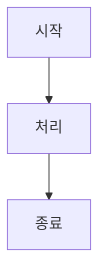

# Mermaid GilView

Mermaid GilView는 Mermaid flowchart 코드를 왼쪽에서 편집하고, 오른쪽 캔버스에서 결과를 보면서 노드와 연결선을 함께 편집할 수 있는 비주얼 에디터입니다.

코드를 수정하면 다이어그램이 갱신되고, 캔버스에서 노드 이동, 라벨 수정, 연결선 추가/삭제를 하면 Mermaid 코드에도 반영됩니다. 작업 내용은 브라우저 `localStorage`에 저장되며 서버로 전송되지 않습니다.

## 설치 없이 사용하기

가장 간단한 방법은 GitHub Release에서 단일 HTML 패키지를 내려받는 것입니다.

1. Releases 페이지로 이동합니다.
   - https://github.com/jinghaneyo/mermaid_GilView/releases
2. 최신 릴리즈의 `mermaid-gilview-v1.0.0.zip` 파일을 다운로드합니다.
3. zip 파일을 압축 해제합니다.
4. `mermaid-gilview.html` 파일을 브라우저로 엽니다.

이 방식은 Node.js, npm, 개발 서버가 필요 없습니다. 파일을 더블클릭해서 열 수 있는 정적 HTML 앱입니다.

## 소스에서 실행하기

개발하거나 직접 수정해서 사용할 때만 아래 과정이 필요합니다.

### 요구 사항

- Node.js 20 이상 권장
- npm

### 설치

```bash
git clone https://github.com/jinghaneyo/mermaid_GilView.git
cd mermaid_GilView
npm install
```

### 개발 서버 실행

```bash
npm run dev
```

실행 후 브라우저에서 표시되는 로컬 주소로 접속합니다. 기본 Vite 주소는 보통 `http://localhost:5173`입니다.

## 직접 패키지 만들기

단일 HTML 파일을 직접 만들려면 다음 명령을 실행합니다.

```bash
npm run build:single
```

결과물은 `dist-single/index.html`에 생성됩니다. 이 파일을 `mermaid-gilview.html`처럼 이름을 바꿔 배포하거나 그대로 브라우저에서 열 수 있습니다.

정적 호스팅용 파일 묶음이 필요하면 다음 명령을 사용합니다.

```bash
npm run build
```

결과물은 `dist/`에 생성됩니다. 이 폴더를 정적 웹 서버나 호스팅 서비스에 업로드하면 됩니다.

빌드 결과를 로컬에서 미리 보려면 다음 명령을 사용합니다.

```bash
npm run preview
```

## GitHub Pages 배포

저장소에는 GitHub Pages용 워크플로우가 포함되어 있습니다.

```text
.github/workflows/deploy.yml
```

이 워크플로우는 `main` 브랜치에 push될 때 `npm run build`를 실행하고 `dist/`를 GitHub Pages에 배포합니다.

단, GitHub 저장소 설정에서 Pages가 GitHub Actions 배포 방식으로 활성화되어 있어야 합니다.

설정 경로:

1. GitHub 저장소의 `Settings`로 이동
2. `Pages` 메뉴 선택
3. `Build and deployment`의 Source를 `GitHub Actions`로 설정

Pages를 사용하지 않고 Release의 단일 HTML 파일만 배포한다면 이 워크플로우는 필수 사항이 아닙니다.

## 주요 기능

- Mermaid flowchart 코드와 캔버스 간 양방향 편집
- 코드 클릭 시 해당 도형으로 캔버스 포커스 이동
- 도형 또는 subgraph 클릭 시 코드 위치 선택 및 강조
- 노드 추가, 삭제, 이동, 라벨 편집
- 연결선 추가, 삭제, 라벨 편집
- subgraph 그룹 박스 이동 및 내부 노드 동반 이동
- 여러 다이어그램을 탭으로 관리
- 라이트/다크 테마 및 격자 표시
- PNG, SVG, `.mmd`, Mermaid 코드 내보내기
- JSON 백업 및 복원
- 브라우저 자동 저장

현재는 Mermaid의 `graph` / `flowchart` 계열 문법을 중심으로 지원합니다.

## 사용법

1. 왼쪽 코드 영역에 Mermaid flowchart 코드를 입력합니다.



2. 오른쪽 캔버스에서 노드와 연결선을 편집합니다.
3. 필요한 경우 PNG, SVG, `.mmd` 또는 코드로 내보냅니다.

## 스크립트

```bash
npm run dev          # 개발 서버 실행
npm run build        # 정적 호스팅용 dist/ 빌드
npm run build:single # 단일 HTML 빌드
npm run preview      # dist/ 빌드 결과 미리보기
npm test             # 테스트 실행
```

## 라이선스

MIT License
